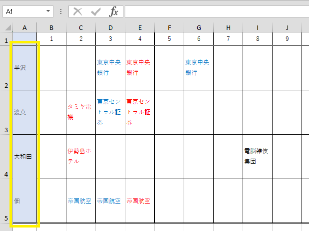
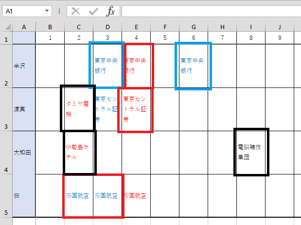
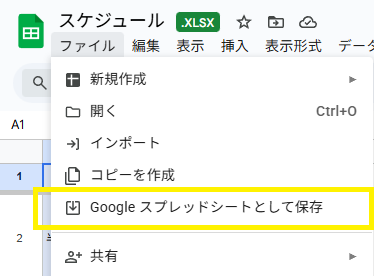
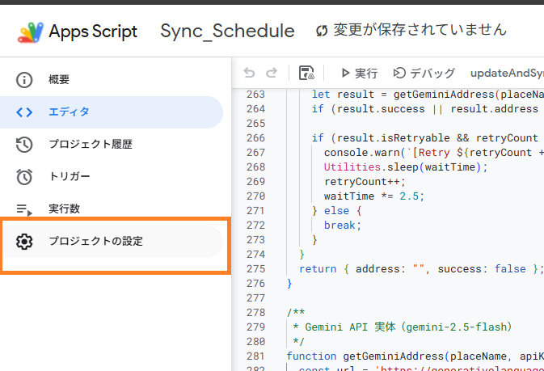
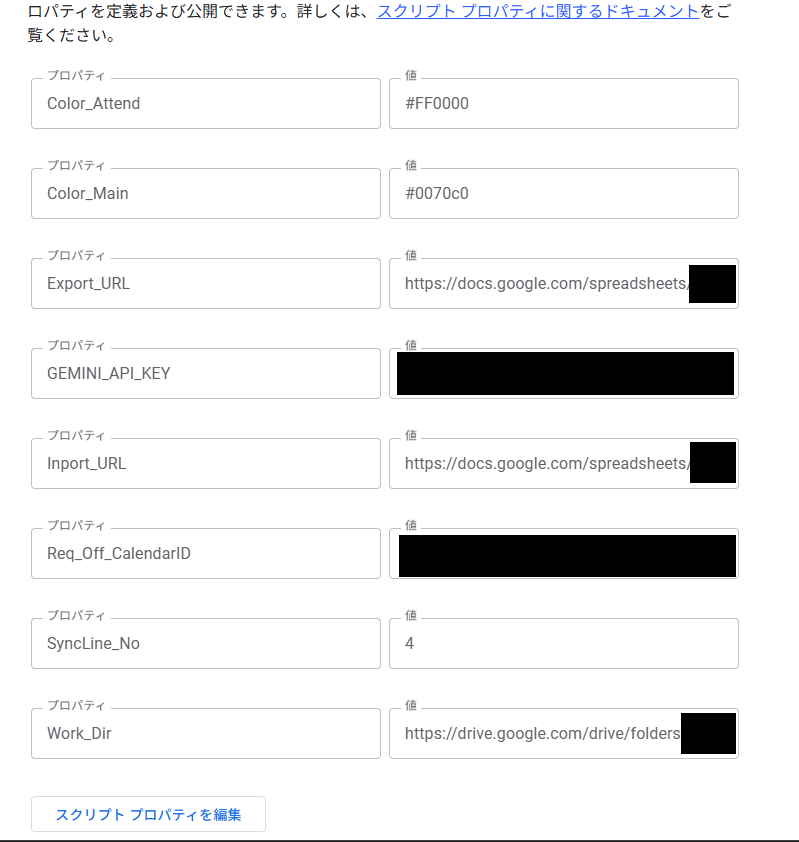

## Sync_Schedule
このシステムは、GoogleドライブにあるExcelファイルから自分のGoogleカレンダーに予定を同期するシステムです  
基本的に、一度スケジューラを設定すれば自動で動き続け、全てGoogleドライブ上で完結するためアプリのインストールなどは必要ありません。

### 免責
完全自己責任でご使用ください。

### 動作環境
* Google App Script

### 使い方
#### Schedule_base.xlsx
1. シート名は"yyyyMM"形式で書いてください。（例：2026年1月の場合、202601）  
2. 1行目は日付用です。  
3. A列には苗字や名前、あだ名など、分かるものを入力してください。  

4. 名前の行にそれぞれ案件名や、現場名などわかるものを記載してください。  

> [!Tip]
> 拡張子を変更しなければファイル名は変更しても問題ありません。
> シフト表.xlsxなどに変更してお使いください。

#### convert_Spreadsheet_this_file.xlsx
1. Googleドライブにスプレッドシートとして保存してください。  

2. Apps Scriptのプロジェクトの設定にある「スクリプトプロパティを編集」からConfigシートのConfigNameと自分の環境の値を入力してください。  

3. こんな感じになります  

### Config名と機能
|ConfigName|Value|Discription|
| -------- | --- | --------- |
| Color_Attend | カラーコード   #FF0000(既定) | 稼働@案件名　というタイトルになります   同じ案件名でメイン案件がある場合のみ、メイン稼働@案件名　このタイトルになります|
| Color_Main | カラーコード   #0070c0 | 設置@ の前に”メイン”という文字がつくようになります |
| Color_Tentative (未実装) | カラーコード   #ffd965 | 設置&稼働@案件名　というタイトルになります |
| Color_Installation (未実装) | カラーコード   #000000(既定) | ハードコードされています 設置@案件名　というタイトルになります |
| Color_Combined (未実装) | カラーコード   #f7caac(既定) | 仮予定@案件名　というタイトルになります |
| Export_URL | URL | スケジュールのコピーが生成されるスプレッドシートのURL |
| Gemini_key | APIキー | Geminiを使用して場所情報を検索するために使用するAPIキー |
| Inport_URL | URL | 元とするスケジュールが記載されているURL |
| Protect_Until | 半角数字 | 予定を変更しない日数の指定 |
| Req_Off (未実装) | カラーコード   #ffff00 (既定) | 希望休の塗りつぶし色指定用 |
| Req_Off_CalendarID | カレンダーID | 希望休(セルが黄色で塗りつぶされている日)が登録されるカレンダー |
| SyncLine_No | 半角数字 | 予定を取得したい行数 |
| Sync_Until | 半角数字 | 同期したい週数 |
| Work_CalendarID | カレンダーID | 案件名が入るカレンダー |
| Work_Dir | URL | 作業ディレクトリとして割り当てるURL |
| Delete_Allday | True/False | Tureの場合全ての予定が再登録されます。Falseの場合、既に同名の案件が登録されていればそのまま残ります。 |

### 実装予定機能（予定は未定😏）
* サイボウズOfficeの予定登録に対応したCSVファイル出力
* 未実装の機能追加